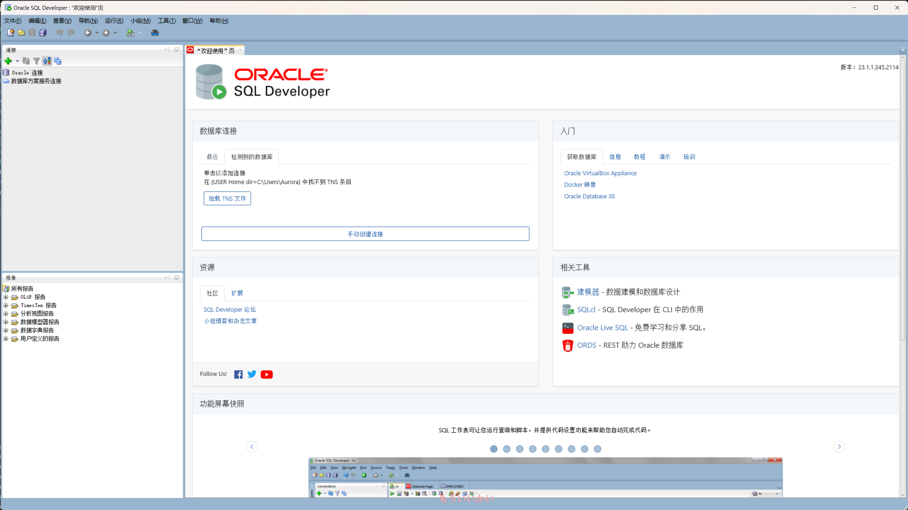

# 怎么安装该死的数据库

真是该死。

## 数据库引擎与管理工具

首先你得区分的开数据库的引擎和数据库管理工具。引擎是数据库的核心，它负责解释执行SQL语句，管理数据的存储和检索，通常运行在性能极为强大的数据中心服务器里。而数据库管理工具是用来管理数据库的，它可以让你更方便的连接数据库、创建数据库、管理数据库、编写SQL语句等等。

你可以理解为数据库引擎就是厨房，而管理工具就是餐厅门面。事实上餐厅服务员并不会烹饪。所以如果你只单一的安装了数据库管理工具，那么你是无法使用数据库的。

幸运的是，学校已经在一台服务器上安装了数据库引擎，我们只需要安装数据库管理工具就可以在校内通过网络连接到数据库引擎了。

学校使用的是 `Oracle` 数据库引擎，版本为 `Database 11g`。

## 下载 Oracle SQL Developer 管理工具

`Oracle SQL Developer` 是一个免费的数据库管理工具，它可以让你连接到Oracle数据库引擎，编写SQL语句，管理数据库等等。

[下载 Oracle SQL Developer](https://www.oracle.com/database/sqldeveloper/technologies/download/)

鉴于大部分同学的电脑都是Windows系统，你应该要点击 `Windows 64-bit with JDK 11 included` 那个位置的下载按钮。

下载完之后解压，你能看到目录中有一个名字叫做 `sqldeveloper.exe` 的可执行程序。双击它，你就可以打开 `Oracle SQL Developer` 了。

~~天哪为什么我还要写怎么解压。oh my god!~~

你应该可以看到这样的界面。

