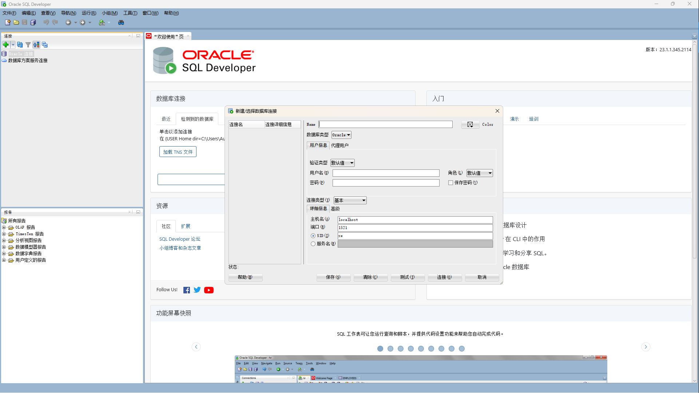
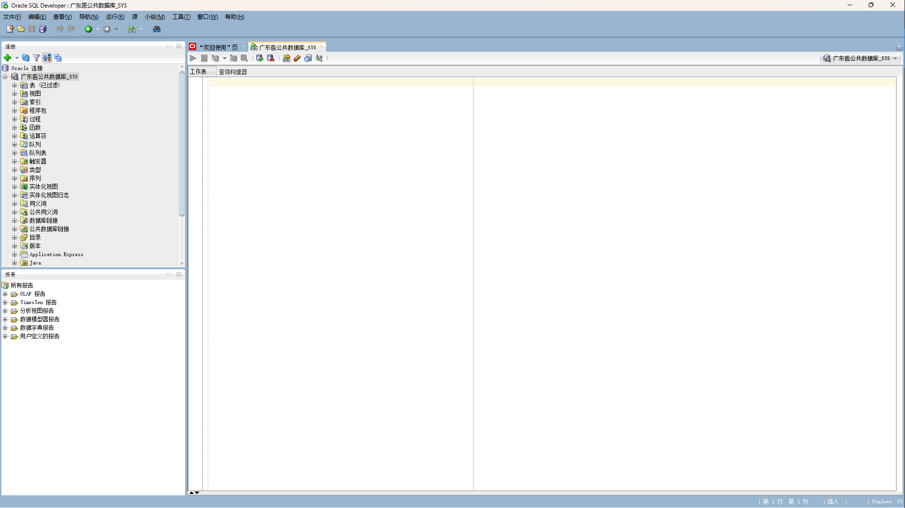
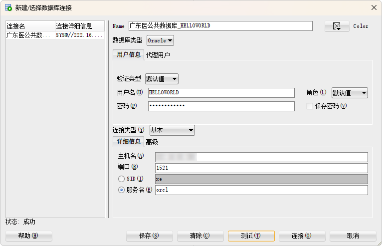

# 如何连接数据库

在确保你安装好数据库管理工具后，你可以开始尝试连接到学校的服务器了。

## 使用SYS角色登录服务器

在开始之前，我们还需要给自己创建个数据库账号，这样我们才能连接到数据库服务器。在这里，我们使用SYS角色登录服务器，然后创建一个新的数据库账号。

SYS是数据库的超级管理员，它有着非常高的权限。

**使用 SQL PLUS**

我们并不希望任何密钥泄露到网络上，所以你需要自行阅读在课堂上发布的文档。

```bash
sqlplus yourusername/yourpassword@yourserver/yourdb as sysdba
```

| 参数 | 说明 |
| --- | --- |
| yourusername | 你的数据库用户名 |
| yourpassword | 你的数据库密码 |
| yourserver | 你的数据库服务器地址 |
| yourdb | 你的数据库名称 |

这个命令中，`sqlplus` 是指数据库管理工具的名称，`yourusername/yourpassword@yourserver/yourdb` 是指连接数据库的参数。`as sysdba` 是指使用SYSDBA角色登录。

> Q: 为什么sys登录需要as sysdba
> 
> 在Oracle数据库中，SYS是一个特殊的用户，它是数据库的所有者，拥有最高权限。SYS用户拥有所有的系统权限，并且可以执行所有的数据字典视图和基表。
> 
> 当我们使用"as sysdba"登录时，我们实际上是在以数据库管理员的身份登录。这意味着我们将获得对数据库的完全控制，包括启动和关闭数据库，备份和恢复，以及其他所有的管理任务。
> 
> "as sysdba"是一个特殊的权限，只有被授权为SYSDBA的用户才能使用。这个权限允许用户执行DBA角色的所有操作，包括一些特殊的操作，如启动和关闭数据库。
> 
> 因此，当我们需要执行一些高级的数据库管理任务时，我们需要以SYS用户身份并使用"as sysdba"登录。

**使用 Oracle SQL Developer**

在图形界面的左侧，你可以看到`连接`选项组。点击绿色加号即可添加一个新的数据库连接。数据库连接标识了你要连接的数据库服务器的网络位置，以及你的用户名和密码等信息。你可以创建很多个连接，每个连接可以连接到不同的数据库服务器。



在弹出的对话框中，你需要填写一些信息。

| 参数 | 说明 |
| --- | --- |
| Name | 连接的名称，用于标识这个连接，你可以任意起名，就像新建一个文件时需要名字一样。 |
| 数据库类型 | `Oracle` |
| 验证类型 | `默认值` |
| 用户名 | 这次填写`SYS` |
| 密码 | 你的数据库密码 |
| 角色 | 这次填写`SYSDBA` |
| 连接类型 | `基本` |
| 主机名 | 你的数据库服务器地址 |
| 端口 | 你的数据库服务器端口 |
| 服务名 | 你的数据库名称 |

在学校提供的服务器上，你可以使用默认的端口`1521`，服务名`orcl`。

你可以点击`测试`按钮来测试你的连接是否成功。



## 执行查询

在数据库中，**查询 (Query)** 是指一系列对数据库的事务操作，它使用SQL语言来编写。比如你可能想要实现一个事务：查询所有的学生信息并将所有男孩子改成女孩子。这个事务就是一个查询。

在Oracle数据库中，你可以使用SQL语句来执行查询。SQL语句是一种特殊的编程语言，它用于与数据库进行交互。SQL语句可以用于查询数据库中的数据，插入新的数据，更新现有的数据，删除数据等。

来吧我们来一个例子。假设我现在有一张表，叫做`STUDENTS`，它有两个字段，`ID`和`GENDER`分别表示学生的学号和性别。

想要查询所有的学生信息并将所有男孩子改成女孩子。

```sql
SELECT * FROM STUDENTS;
UPDATE STUDENTS SET GENDER = '女' WHERE GENDER = '男';
```

这两个语句分别是查询和更新操作。第一个语句查询了所有的学生信息。注意到`*`号表示查询所有的字段，`FROM` 表示从哪个表中查询。
第二个语句将所有的男孩子改成了女孩子。`UPDATE`表示更新操作，`SET`表示设置它描述了我们希望修改的字段和修改后的值，`WHERE`是一个限定条件，它表示我们只希望修改性别是男生的学生。

~~哦不，你不会真的这么想吧，性转什么的太*了。~~

*在此后我们将不再提供 sql plus 用法。 因为本质上sql plus也只是一个数据库客户端，sql语句都可以在任何数据库客户端中执行。*

## 创建表空间

开始之前创建用户之前，我们需要一些准备操作，你需要明确一些简单的概念。

- 数据库模式（Schema）：在Oracle中，模式是数据库用户的命名空间，它包含了用户创建的所有对象。换句话说，模式就是一个用户的工作区。在这个工作区中，用户可以创建表、视图、序列、存储过程、函数等数据库对象。

- 用户（User）：在Oracle中，用户是一个账户，拥有用户名和密码。用户可以拥有一些数据库对象，这些对象存储在用户的模式中。用户可以被授予一些权限，以执行特定的操作，如创建表、插入数据等。

- 表空间（Tablespace）：表空间是Oracle数据库中存储数据的逻辑单位。一个表空间可以包含多个数据文件，数据文件是存储在磁盘上的物理文件。表空间是Oracle管理存储空间的方式，它将物理存储空间映射到逻辑存储结构（如表和索引）上。

也就是说，新建一个数据库用户相当于新建一个数据库模式，这个模式用于表示你创建的所有对象。而表空间则是用于存储这些对象的地方。就像`神里绫华`可能会养一只小狗`神里绫华.狗狗`，同时她可能也会养一只猫猫`神里绫华.猫猫`，这两只宠物都是**属于**`神里绫华`的`对象`，`神里绫华`是这些宠物的`模式`，而`神里屋敷`(神里绫华和作者的家)就是`表空间`。

现在我们可以创建表空间了。每个用户都有一个默认的表空间和一个临时表空间。

- 默认表空间（Default Tablespace）：当用户创建一个新的数据库对象（如表或索引）时，如果没有明确指定表空间，那么这个对象就会被创建在用户的默认表空间中。默认表空间在创建用户时指定。

- 临时表空间（Temporary Tablespace）：临时表空间用于存储数据库操作的中间结果，如排序操作。当数据库执行一些需要大量磁盘空间的操作时，它会使用临时表空间。临时表空间在创建用户时指定，如果没有指定，用户会使用数据库的默认临时表空间。

```sql
CREATE TABLESPACE HelloWorld
    DATAFILE 'C:\app\administrator\oradata\orcl\HelloWorld.dbf'
    SIZE 30m;
```

`CREATE TABLESPACE`是创建表空间的语句，`HelloWorld`是表空间的名字，`DATAFILE`是数据文件的路径，`SIZE`是数据文件的大小。

你可能注意到这个指令含有换行，并且以分号结尾。这是因为SQL语句是可以换行的，而分号是SQL语句的结束符。通常我们把主要语义放在一行，而把一些参数放在下一行，这样可以使得SQL语句更加清晰可读。

```sql
CREATE TEMPORARY TABLESPACE HelloWorldTmp 
    TEMPFILE 'C:\app\administrator\oradata\orcl\HelloWorldTemp.dbf' 
    SIZE 30m;
```

`CREATE TEMPORARY TABLESPACE`是创建临时表空间的语句，`HelloWorldTmp`是表空间的名字，`TEMPFILE`是临时数据文件的路径，`SIZE`是临时数据文件的大小。

## 创建用户

好了，当我们准备好表空间后就可以开始创建用户了。

```sql
CREATE USER HelloWorld IDENTIFIED BY YourPassword
    DEFAULT TABLESPACE HelloWorld
    TEMPORARY TABLESPACE HelloWorldTmp;
```

`CREATE USER`是创建用户的语句，`HelloWorld`是定义用户的名字，`IDENTIFIED BY`是定义用户的密码，`DEFAULT TABLESPACE`是定义用户的默认表空间，`TEMPORARY TABLESPACE`是定义用户的临时表空间。

这里我们新建了一个用户`HelloWorld`，密码是`YourPassword`，默认表空间是`HelloWorld`，临时表空间是`HelloWorldTmp`。

## 授权

在Oracle中，用户可以被授予一些权限，以执行特定的操作，如创建表、插入数据等。这些权限可以被授予给用户，也可以被授予给角色。用户可以拥有多个角色，角色可以拥有多个权限。

```sql
GRANT CONNECT, DBA TO HelloWorld;
```

`GRANT`是授权的语句，`CONNECT`和`DBA`是权限的名字，`TO`是授权给谁。

在这里，我们授予了`HelloWorld`用户`CONNECT`和`DBA`权限。`CONNECT`权限允许用户连接到数据库，`DBA`是 Database Admin 的缩写，该权限允许用户执行DBA角色的所有操作，包括一些特殊的操作，如启动和关闭数据库。这是一个十分重要且危险的权限，在生产环境中我们应该使用更加详细的权限控制，这些在后续讨论。

## 使用自己的用户登录

那么到这里你就完成了创建用户的所有操作了。接下来你可以使用你的用户名和密码连接到数据库了。

**使用 SQL PLUS**

```bash
sqlplus HelloWorld/YourPassword@host/orcl
```
**使用 Oracle SQL Developer**

